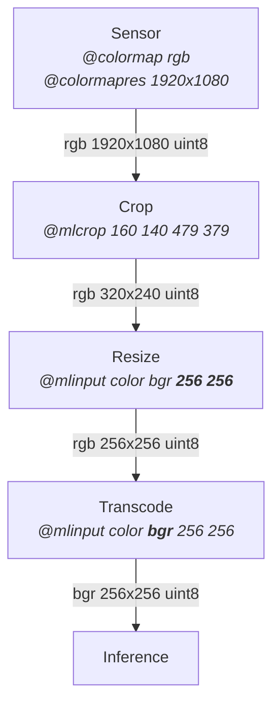

---
products:
  - dp.kinect3
  - dp.oak
mermaid: true
tags:
  - machine learning
usage:
  signature: "Source [FourCC [Width Height]]"
  values: "@mlinput color rgb (default)"
  examples:
    - "@mlinput color bgr"
    - "@mlinput color grey"
    - "@mlinput color bgr 256 160"
    - "@mlinput color grey 256 160"

---

Machine learning input by source, FourCC, and shape.
The default `@mlinput color rgb` transcodes color sensor raw data into a 3-channel
tensor (in order red green blue) then resizes the tensor to the model's declared
input size requirement.

* `color` is the only source supported at this time
* Optional FourCC code declares the encoding and channels for your model's tensor input.
Only packed FourCC codes are supported, e.g. `bgr`, `bgra`, `rgb`, `rgba`, `argb`, `grey`,
`y16`, `z16`, etc.
* Optional width and height long integer parameters force specific tensor pixel
dimensions. Useful with models that do not have a declared
input size requirement stored within the model itself.

Use [`@mlcrop`](mlcrop.md) to control the aspect ratio and crop of data.
Use [`@mlmean`](mlmean.md) and [`@mlscale`](mlscale.md) to normalize data.

### Examples

```sh
@mlinput color grey           # color converted to greyscale 1-channel
@mlinput color bgr            # color 3-channel order blue green red
@mlinput color rgba           # color 4-channel order red green blue alpha
@mlinput color rgb 256 160    # color 3-channel order red green blue at 256x160
```

## Pipeline

Data must be prepared before inference. The model and inference engine both have
their requirements. Imagine your sensor provides color data at 1920x1080 resolution
and your model has the following requirements:

* bgr color, i.e. color described as three primary components in the order blue, green, red
* color components as 8-bit unsigned integers
* resolution of 256x256, aspect ratio does not have to be kept
* use only sensor color data from the 320x240 rectangular region (160 140) to (479 379)

Solution: `@colormap rgb @colormapres 1920x1080 @mlcrop 160 140 479 379 @mlinput color bgr 256 256`

* `@colormap rgb` configure sensor for color, output rgb from the color outlet,
  default to 8-bit unsigned integers
* `@colormapres 1920x1080` configure sensor for 1920x1080 color, output 1920x1080
  resolution from the color outlet
* `@mlcrop 160 140 479 379` crop sensor's 1920x1080 color data to the 320x240 rectangular
  region (160 140) to (479 379), do not keep aspect ratio if resized later
* `@mlinput color bgr 256 256` change the color component order to bgr, resize data
  to 256x256. Note that this 256x256 model input tensor is squeezed horizontally and slightly
  stretched vertically; its aspect ratio changed when resized from 320x240 to 256x256.

Below is a logical representation of this data preparation pipeline.
This is not the exact sequence due to optimization.


