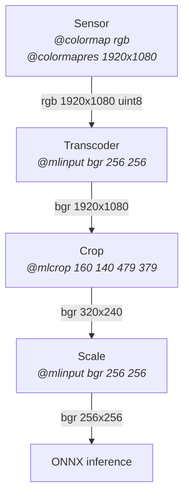

---
products:
  - dp.kinect3
  - dp.oak
mermaid: true
tags:
  - machine learning
usage:
  signature: "[FourCC [Width Height]]..."
  values: "mlinput rgb (default)"
  examples:
    - "@mlinput bgr"
    - "@mlinput rgb z16"
    - "@mlinput rgb 256 160"
    - "@mlinput rgb 256 160 z16"

---

Machine learning input source and channels using a list of FourCC codes.
The default `@mlinput rgb` transcodes color sensor raw data into a 3-channel
tensor (in order red green blue) then resizes the tensor to the model's declared
input size requirement.

Choose the FourCC codes for each your model's tensor inputs.
Only packed FourCC codes are supported, e.g. bgr, bgra, rgb, rgba, argb, grey,
y16, z16, etc.

Use the optional width and height parameters with each FourCC code to force
specific tensor dimensions. Useful with models that do not have a declared
input size requirement stored within the model itself.

### Examples

```
@mlinput grey                      # greyscale 1-channel
@mlinput bgr                       # color 3-channel order blue green red
@mlinput rgba                      # color 4-channel order red green blue alpha
@mlinput rgb 256 160               # color 3-channel order red green blue at 256x160
@mlinput rgb z16                   # color 3-channel order red green blue,
                                     and depth unsigned 16-bit int
@mlinput rgb 256 160 y16           # color 3-channel order red green blue at 256x160,
                                     and depth unsigned 16-bit int
@mlinput rgb y16 640 400           # color 3-channel order red green blue,
                                     and depth unsigned 16-bit int at 640x400
@mlinput rgb 256 160 y16 640 400   # color 3-channel order red green blue at 256x160,
                                     and depth unsigned 16-bit int at 640x400
```

## Pipeline

Our Max plugins have several pipelines to do work. One of them prepares data for inference.
Imagine your sensor provides color data at full HD resolution (1920x1080).
You have a model and it requires color data with the following requirments:

* color components in the order blue, green, red
* color components as 8-bit unsigned integers
* only use the color data from the 320x240 square region (160 140) to (479 379)
* model input tensor must be resolution 256x256
* aspect ratio does not have to be kept

Solution: `@colormap rgb @colormapres 1920x1080 @mlinput bgr 256 256 @mlcrop 160 140 479 379`.
The 256x256 input tensor will be squeezed horizontally and slightly stretched vertically;
its aspect ratio changed when it went from its original 1920x1080 -> cropped 320x240 ->
final 256x256. Technica
Use [`@mlcrop`](mlcrop.md) to control the aspect ratio and crop.
Use [`@mlmean`](mlmean.md) and [`@mlscale`](mlscale.md) to standardize real-time input for these models.

Below is a logical representation of this data preparation pipeline.
This is not the exact order of steps due to internal optimization.


